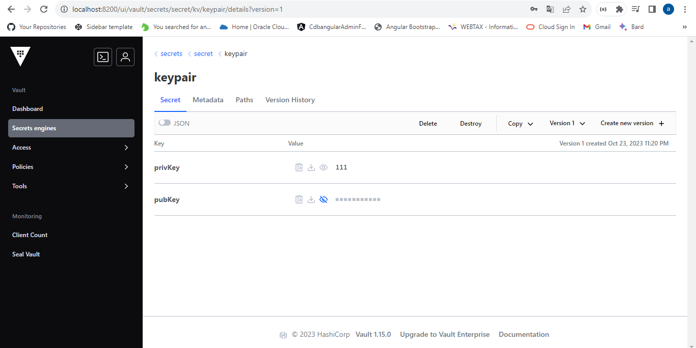
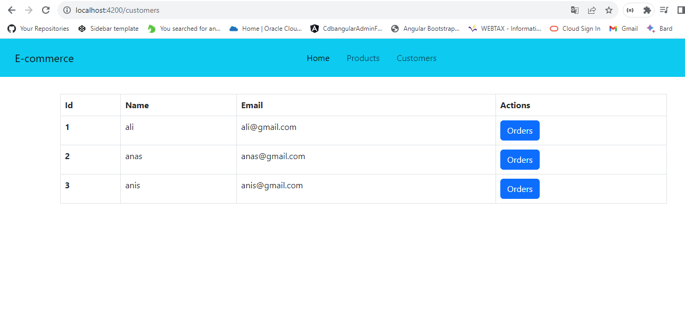

# e-commerce microservices application

The application follows a robust and scalable architecture built on Spring Boot and Angular. It adopts a microservices approach, ensuring flexibility, scalability, and ease of maintenance. This architecture is designed around four essential services, each serving a specific purpose, and a Configuration Service that manages the application's configurations seamlessly.


# Backend Services

We have 5 services :

## Config Service
`This service contain configuration of all services`

we specify to folder of all config files :

`spring.cloud.config.server.git.uri=file:///C:/Users/hp/Desktop/IdeaProjects/e-commerce-application/config-repo`

start the consul server :

`consul agent -server -bootstrap-expect=1 -data-dir=consul-data -ui -bind=@IP`

To show registred services :

`http://localhost:8500/`


## Gateway Service

````
Spring Cloud Gateway It provides a centralized entry point for routing and filtering requests
to microservices in a distributed system, enabling dynamic and scalable routing based on various criteria.
````
we use dynamic routing :

```java
@Bean
DiscoveryClientRouteDefinitionLocator dynamicRoutes(ReactiveDiscoveryClient rdc, DiscoveryLocatorProperties dlp){
    return new DiscoveryClientRouteDefinitionLocator(rdc, dlp);
}
```

## Customer Service

## Inventory Service

## Order Service

## Billing Service

vault:

`vault server -dev`

`set VAULT_ADDR=http://127.0.0.1:8200`

`storing two keys in vault`




# Frontend with Angular

### Products


### Customers


### Orders of a customer


### Details of an order
